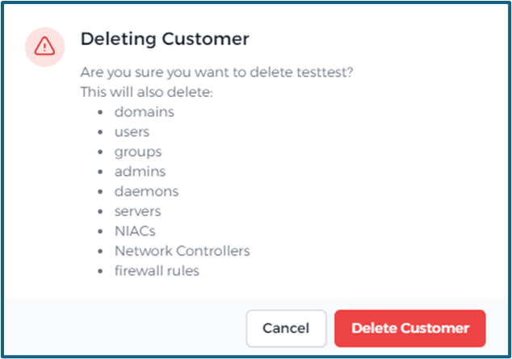

# Customers
> [!WARNING]
> This *`Customers`* section is exclusively available for **integrators**. If you are an end customer, you will be directly redirected to the Network Isolation configuration of your company.

In our platform, a **customer** refers to a company intending to use Network Isolation. Integrators have the capability to manage these customers, ensuring seamless operations and service delivery.

For clarity, consider a scenario where a company named *`Astral Voyage`* wants to use Network Isolation. You must first create *`Astral Voyage`* as a customer on the platform before any further configurations or service provisions can occur.

## Create customer

To incorporate a new customer into the platform, click on the `Create new` button

prominently located at the upper right corner of the interface.

Following fields should be provided:
	
  - Name
  - Display name
  - Primary contact email

> [!WARNING]
>  In the customer name, spaces and special characters/symbols are not allowed. You can add the full name in "Display name"
  

## Edit customer
Customers can be edited by clicking on the yellow pencil icon next to their name .

> [!WARNING]
> Changing the integrator will remove all current integrator roles.

## Delete customer

Customers can be deleted by clicking on the red trash bin icon next to their name .

> [!WARNING]
> Ensure there are no ongoing processes, tasks, or linked records associated with a customer before attempting to delete. Always verify and clear any dependencies in other sections of the platform before removal.

You will receive a warning before the customer is permanently deleted:

