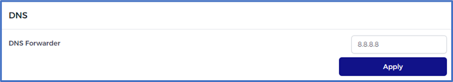
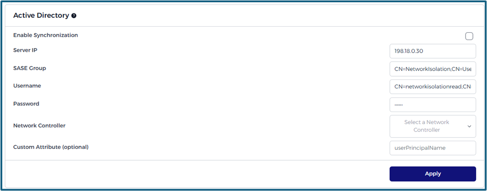
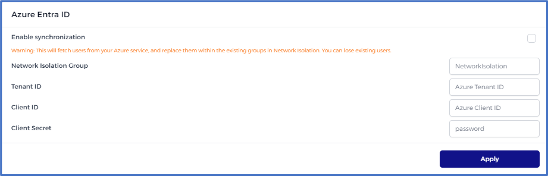

# Integrations

> [!INFO]
> Comprehensive information can be found [here](/networkisolation/ni-active-directory).
@todo

## DNS

A DNS forwarder redirects DNS queries from one server to another. It's useful for managing and speeding up DNS queries by redirecting requests to a faster or more updated DNS server than the one set by default.
To do so, enter the IP address DNS server and click on the apply button.

## Active Directory

## Azure Entra ID

Synchronize your user data seamlessly from Azure Entra ID to the Network Isolation platform. This ensures that user information remains consistent across both platforms, providing ease of user management.

### **Steps to Enable Synchronization**:

1. **Network Isolation Group**: Designate a default group in Network Isolation where new users from Azure  Entra ID will be placed.

2. **Tenant ID**: A unique identifier that represents your Azure Entra ID organization.

3. **Client ID**: Represents the application registration in Azure  Entra ID.

4. **Client Secret**: A password created for the application registration in Azure Entra ID. This is used to authenticate the application during the synchronization process.

> [!WARNING]
> Ensure that you have appropriate permissions in Azure Entra ID to enable synchronization and always backup user data in Network Isolation before starting the process. 

## API Keys

API keys are a way to authenticate and grant access to various resources of an application or platform via its API. They are typically used to facilitate the interaction of third-party software with your application, enabling automation, integration, and other advanced functionalities.
