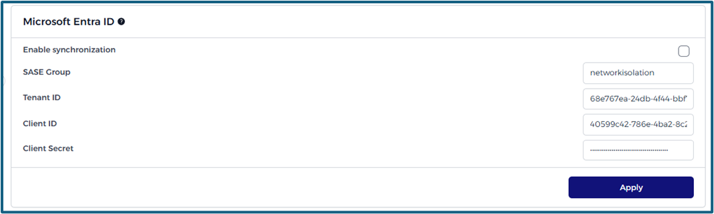

# Integrations

<!-- ## Credentials: API Key

API keys are a way to authenticate and grant access to various resources of an application or platform via its API. They are typically used to facilitate the interaction of third-party software with your application, enabling automation, integration, and other advanced functionalities.

 -->

## DNS

A DNS forwarder redirects DNS queries from one server to another. It's useful for managing and speeding up DNS queries by redirecting requests to a faster or more updated DNS server than the one set by default.
To do so, enter the IP address DNS server and click on the apply button.

## Active Directory

> [!INFO]
> Comprehensive information can be found [here](/./advanced/activedirectory/activedirectory.md).

<!-- > [!INFO]
> To activate this setting, you need to disable Microsoft Entra ID syncing as indicated.

 -->

## Microsoft Entra ID

Synchronize your user data seamlessly from Azure Entra ID to the Network Isolation platform. This ensures that user information remains consistent across both platforms, providing ease of user management.

> [!INFO]
> Comprehensive information can be found [here](/./advanced/entraid/entraid.md).

### **Steps to Enable Synchronization**:

<!-- 1. **Network Isolation Group**: The name of a group on Microsoft Entra ID where all groups that should be synchronized are a member of. All member groups of this group (and their users) will be synced to Network Isolation. -->

1. **SASE Group**: The name of a group on Microsoft Entra ID where all groups that should be synchronized are a member of. All member groups of this group (and their users) will be synced to Network Isolation.

2. **Tenant ID**: A unique identifier that represents your Microsoft Entra ID organization.

3. **Client ID**: Represents the application registration in Microsoft Entra ID.

4. **Client Secret**: A password created for the application registration in Microsoft Entra ID. This is used to authenticate the application during the synchronization process.

> [!WARNING]
> Ensure that you have appropriate permissions in Microsoft Entra ID to enable synchronization and always backup user data in Network Isolation before starting the process.

<!-- ## API Keys

> [!INFO]
> Comprehensive information can be found [here](/./company/users/personalaccesstokens.md). -->

