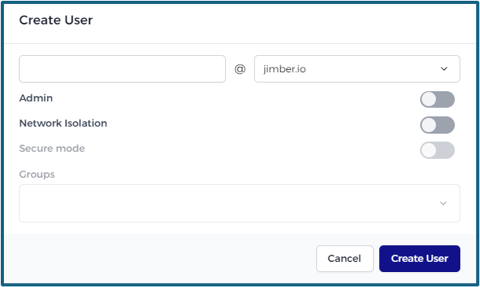

# Users

A user is a user on the platform. Users can have roles and be linked to properties of different products.

> [!WARNING]
> In order to create a new user, the company **must** have a domain.

> [!WARNING]
> Managing users efficiently is crucial for maintaining the security and integrity of your platform. 

## Create a New User
To create a new user into the platform, click on the `Create new`  button

prominently located at the upper right corner of the interface.

> [!INFO]
> **Email** is used as the primary identifier for a user. It is essential for authentication purposes. Ensure that the provided email is valid and accessible by the user. 

### User Roles and their permissions

- **Admin**:
  - Allows the user to log into the security platform.
  - Grants privileges to manage the company's settings.
  - To promote a user to an administrator, hit the slider.

    

- **Security Consultant**:
   - This option is only available for **integrators**.
   - Enables a user to manage configurations of customers.
   - To gain access, the security consultant must be created as an admin.

    
  
- **Enable Network Isolation**:
  - Activating this option will enable `Network Isolation` for the particular user, adding an extra layer of security.
  - To activate Network Isolation, hit the slider.
  
    
  - Groups are optional. 

> [!INFO]
>  Groups must be created to generate a user who can activate Network Isolation.
> The email must come from the company's list. 

  
- **Enable Secure mode**:
  - If Secure mode is turned ON for a device all incoming traffic will be blocked unless it comes from Network Isolation.
  - To turn on Secure mode, hit the slider.

 ## Editing a User
  
 Users can be edited by clicking on the yellow pencil icon next to their name .
 
  
  
  The username cannot be changed, of course, but all other options are the same as when creating a user.
  
## Deleting a User

 Users can be deleted by clicking on the red trash bin icon next to their name .
 
 You will receive a warning before the user is permanently deleted:
 
 
  