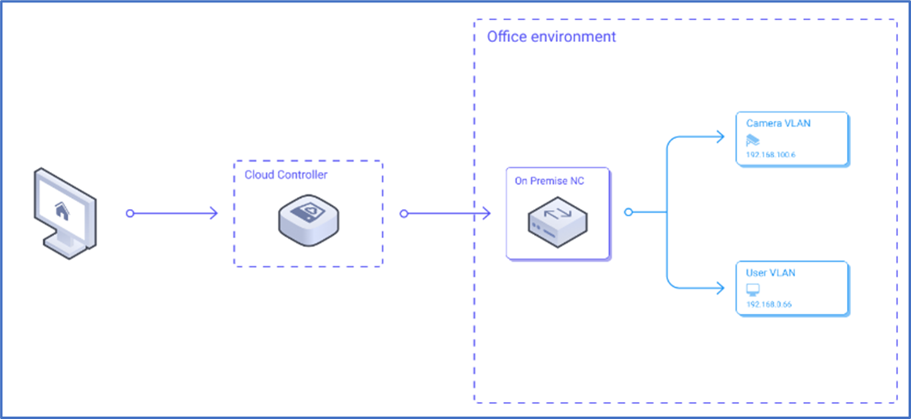

# Native Devices

Native Devices can be any network device that is reachable through a Network Controller. Once a Native Device has been created, rules can be applied to the Native Device the same way rules are applied to servers and NIACs. While traffic to Native Devices is not encrypted on the network layer, they can be a safe way to reach devices that are only reachable by the Network Controller by connecting or giving access to the Network Controller to a specific VLAN.

For instance, should an IP camera be situated within the camera VLAN and access by specific users is required, you can register the camera's IP as a Native Device with the on-premises Network Controller. By establishing the appropriate access rules, users will then be able to access the camera from any location through Jimber Network Isolation.

## Create Native Device
To create a new native device into the platform, click on the `Create new`  button

prominently located at the upper right corner of the interface.

                    
The hostname is mandatory and must be alphanumeric. Select the appropriate network controller and enter the valid IP address.

> [!INFO] 
> Once the native device is created the admin needs to add a 'Allow Custom Port' rule that gives specific groups access to the native device (under destination).

 **For example:**

 We create a native device 'Websitetest':

 Now we add a new 'Allow Custom Port' rule where group testers77 can ping to the native device called 'Websitetest'. 
 
 
 
 All other groups can't reach the native device unless specifically said so by adding a new 'Allow Custom Port' rule.

## Edit Native Device
  
 A native device can be edited by clicking on the yellow pencil icon next to its name .
 
  

   
  
  ## Delete Native Device

 A native device can be deleted by clicking on the red trash bin icon next to its name .
 
 You will receive a warning before the device is permanently deleted:
 
 
  