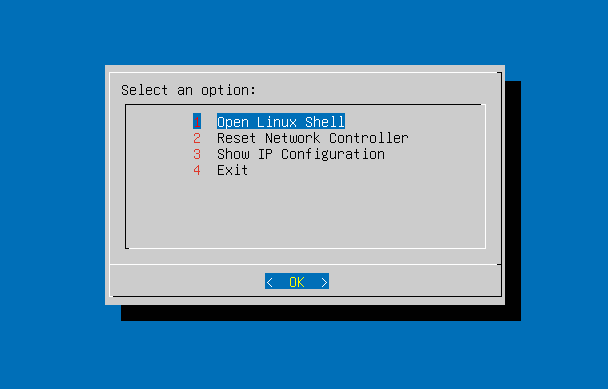
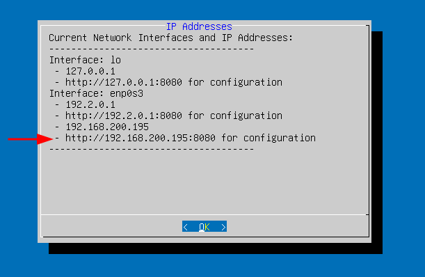
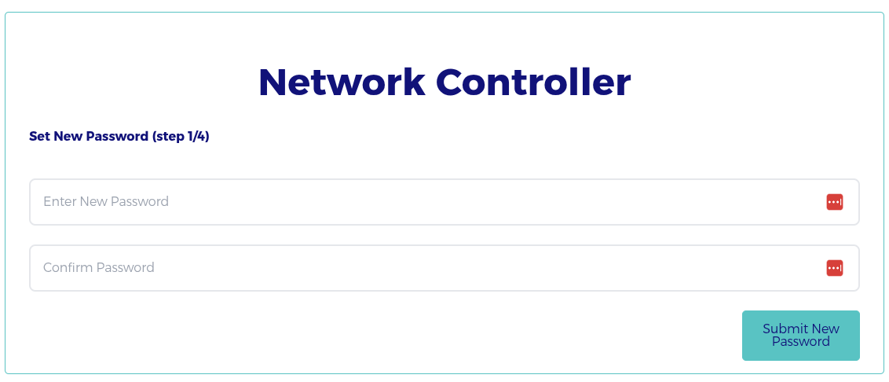
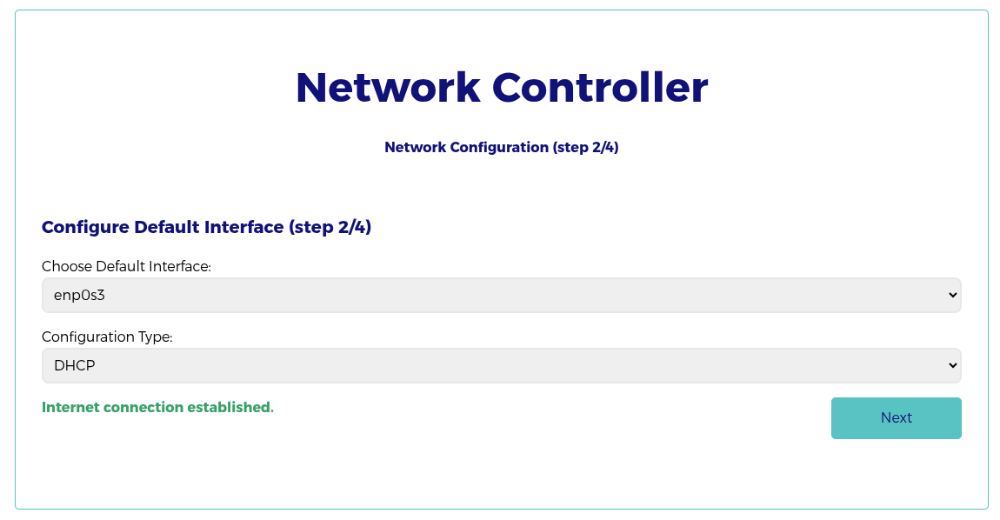
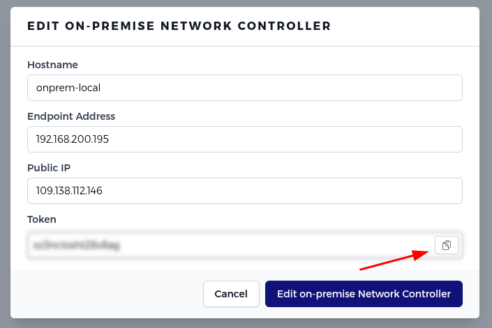
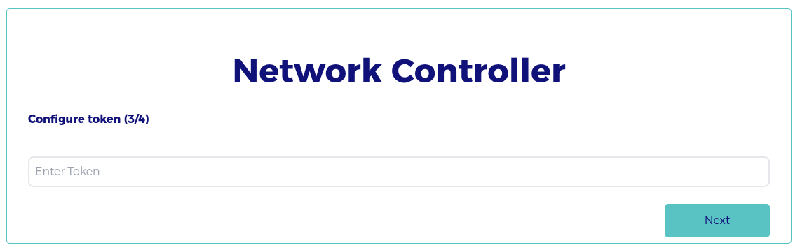
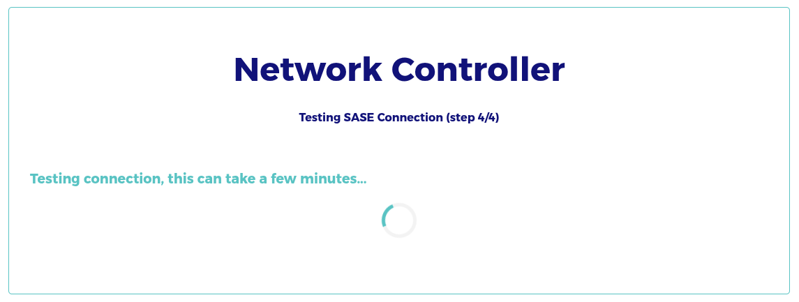
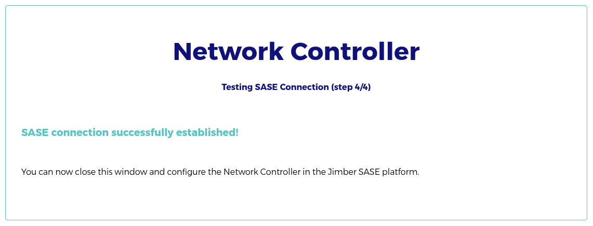
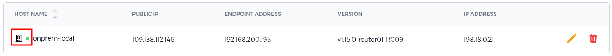

# Installation of the Network Controller

> [!Note]
> If you intend to install this server virtually, please consider the necessary BIOS settings listed at the bottom of this page.

**Start of the installation**

Download the latest version for the 'Network Controller' from https://signal.jimber.io/downloads (no need to login).

Use the downloaded file to install the Network Controller. 

Click on Enter.

In the window "Guided storage configuration", you can hit 'Done'. You get an overview of the storage configuration. Here and in the next window, you can also choose for 'Done'. 

<!-- Then you will see a window with the message “Confirm destructive action”. This is a warning that all data on the used disks will be lost. Only in case of starting this process by mistake, you can choose here for “Continue”. -->

In the next window you have to confirm that all data on the used disks may be lost. Choose here for “Continue”. 

The installation process will then begin and can take several minutes.

While Network Isolation is installing,  you can create your Network Controller on https://signal.jimber.io.  You can find more explanation on how to do so [here](https://docs.jimber.io/#/./devices/networkcontrollers/networkcontrollers).

Data you need:
- Your Public IP. Use https://whatismyipaddress.com/ if necessary. 
- Token: copy it!
- Endpoint Address: see next step.

> [!Warning]
> After installation is complete, reboot the system.

**Continuation of the installation**

You need this data to proceed (hit "Enter" if necessary):
- username: jimber
- password: jimber

On the next screen select option 3 to show the ip configuration of the network controller.

Now use a pc that is on the same network as the network controller and go to the shown web url of option 3. This web interface is used to further setup the network controller.

> [!Note]
>Use the IP shown to finish creating the network controller on the signal platform, this IP can be filled in under the endpoint address.

Login with jimber on the web interface

Set a new password, note that it has to be at least 16 characters long!

Select the right network configuration and then click on 'test connection'. If successful you can go to the next step.

If it fails please check that the network controller has internet connection and the config is correct in the web interface.

Go to the signal platform and copy the token of the network controller you just created. You can find the token by editing the network controller with the yellow pencil.

Paste this token into the web configuration of the network controller. Then hit next

Please wait a moment when you see this screen:

when the connection is established you will get the following screen:

Confirm that your network controller is now online on the signal platform under the network controller page

### Hypervisor installation

Hypervisor installation is widely used. It's a very convenient way of working. The major advantage is that the network controller server can be installed on existing hardware. Therefore, there's no need for a physical device. However, there are some settings you need to consider.

The following minimum hardware settings must also be set:    
  - 2 cores
  - 4 GB RAM
  - 25 GB of hard disk space
   

#### VMware ESXi

When installing the network controller on-prem on ESXi, you need to make sure to select BIOS as the firmware type:

#### Hyper-V

When installing a virtual machine on Hyper-V, you can choose for a virtual machine of the first generation or a virtual machine of the second generation.

##### Creating a Hyper-V server

Open the Hyper-V manager:

Select the server and in the menu-item Actions choose `New Virtual Machine`. Follow the steps of the Wizard:

1. Specify name and location
2. Specify generation. 
> [!Note]
> If you don't see this option, it means you have an older version of Hyper-V. That is no problem.

Here you have to choose between Generation 1 or Generation 2. If you are not sure which one to choose, you can consult this page: https://learn.microsoft.com/en-us/windows-server/virtualization/hyper-v/plan/should-i-create-a-generation-1-or-2-virtual-machine-in-hyper-v 

3. Assign memory: 4 GB. Activate the option 'Use Dynamic Memory for this virtual machine'.
4. Configure network: choose for New Virtual Switch.
5. Create virtual disk: at least 25 GB.
6. Installation options: iso-file.

7. Next step is a summary of the chosen options. After hitting the 'Finish'-button the installation begins as described above.

> [!Warning]
> After installation you have to restart the server and you could face this error message:
>

<!-- tabs:start -->

###### **First generation**

In the list of Virtual Machines, choose in the quick menu of the virtual machine 'Settings':

Change the **startup order** to IDE. In the 'Action'-menu of the virtual machine choose 'Reset'. 
Now the Network Controller should start.  

 
###### **Second generation**

In the list of Virtual Machines, choose in the quick menu of the virtual machine 'Settings'.

1. Choose the option Security and  uncheck the option 'Enable Secure Boot'.

2. Choose the option Firmware and change the **boot order** to Hard Drive. 

In the 'Action'-menu of the virtual machine choose 'Reset'. 
Now the Network Controller should start.  

<!-- tabs:end -->