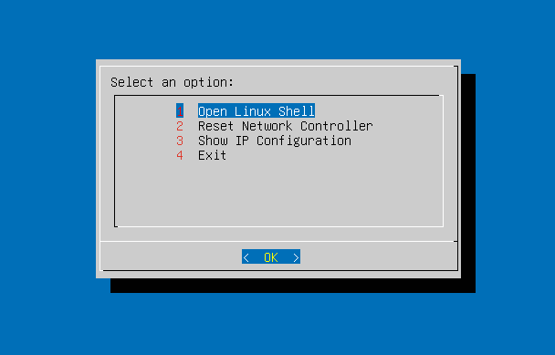

# Installation of the Network Controller

> [!Note]
> If you intend to install this server virtually, please consider the necessary [BIOS settings](/./advanced/hypervisorinstallation/hypervisorinstallation.md) 

<!-- listed at the bottom of this page. -->

Download the latest version for the 'Network Controller' from https://signal.jimber.io/downloads (no need to log in).

Use the downloaded file to install the Network Controller. 

Press Enter.

In the window "Guided storage configuration", you can hit 'Done'. You will get an overview of the storage configuration. Here and in the next window, you can also hit 'Done'. 

<!-- Then you will see a window with the message “Confirm destructive action”. This is a warning that all data on the used disks will be lost. Only in case of starting this process by mistake, you can choose here for “Continue”. -->

In the next window you will be informed that all data on the used disks may be lost. Choose to “Continue”. 

The installation process will then begin, which can take several minutes.

While the installation is in progress, you can create your Network Controller on https://signal.jimber.io. 
Data you need:
- Your Public IP. Use https://whatismyipaddress.com/ if necessary. 
- Token: copy it!
- Endpoint Address: see next step.

> [!INFO]
> Detailed instructions for the creation of an on-prem Network Controller are available [here](/./devices/networkcontrollers/networkcontrollers.md).

> [!Warning]
> After installation is complete, reboot the system.

**Continuation of the installation**

You need this data to proceed (hit "Enter" if necessary):
- username: jimber
- password: jimber

On the next screen select option 3 to show the IP configuration of the Network Controller.

Now use a PC that is on the same network as the Network Controller and go to the shown web URL of option 3 which opens an interface to continue the installation of the Network Controller.

> [!Note]
>Use the displayed IP address to complete the installation of the Network Controller on the `Jimber SASE Platform` by filling it in under the endpoint address.

Login with `jimber` as password on the web interface.

Set a new password.

>[!Warning] 
>The new password has to be at least **16** characters long!

Select the right network configuration and then click on . If successful you can go to the next step.

> [!Note]
> If it fails please check that the Network Controller has an active internet connection and the configuration on the web interface is done correctly.

Go to the `Jimber SASE Platform` and copy the token of the Network Controller you just created. You can find the token by editing the Network Controller with the yellow pencil.

Paste this token into the web configuration of the Network Controller. Then hit next.

Please wait a moment while the connection is being tested.

When the connection is established you will get the following screen:

Confirm that your Network Controller is now online on the `Jimber SASE Platform` under the Network Controller page.

### Hypervisor installation

Hypervisor installation is widely used as iy's a very convenient way of working. The major advantage is that the Network Controller Server can be installed on existing hardware. Therefore, there's no need for a physical device. 

> [!INFO]
> Detailed instructions are available in the Advanced section [here](/./advanced/hypervisorinstallation/hypervisorinstallation.md).
