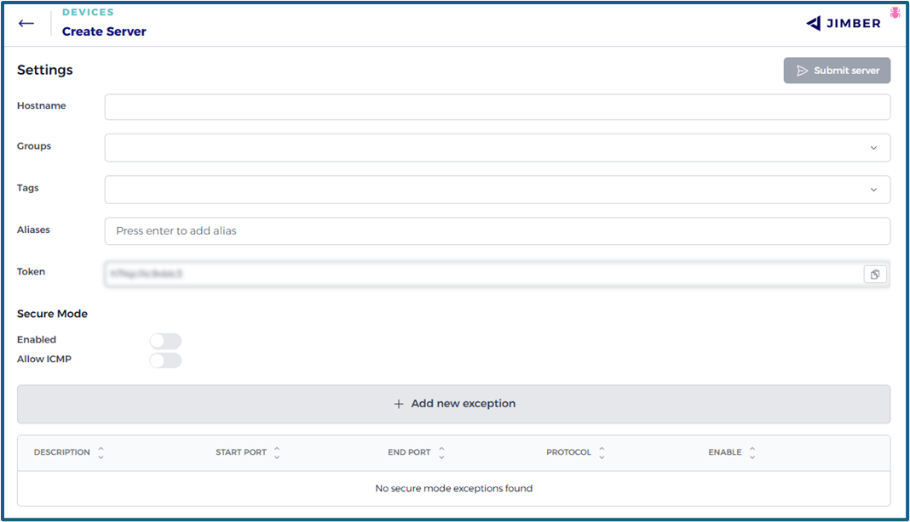
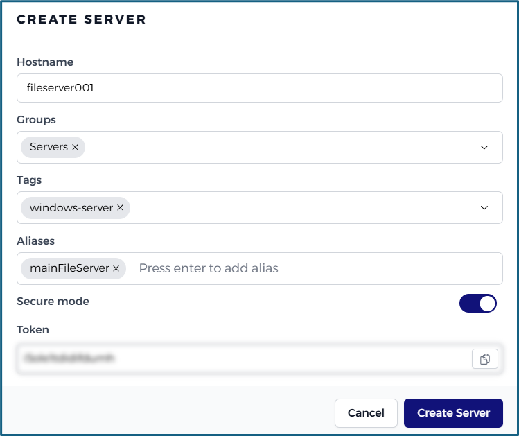

#  Servers

### Create Server

To create a server in the `Jimber SASE Platform`, click on the `+ Create new` button located at the upper right corner of the interface. This will open following dialog box:



<!--  -->
 
> [!INFO] 
> - Hostname is mandatory and must be a lowercase string. 
> - You can create a new tag or use a saved tag.
> - If DNS override is enabled, the server can be accessed using its alias as a resolved hostname.
> - We advise you to copy the token as you will be needing it for the installation of the server, but you can still access it at any time on the editing screen of the server on the `Jimber SASE Platform`.


### Server installation

#### Platforms 

> [!INFO] 
> First create your server on the `Jimber SASE Platform` (see above).

<!-- tabs:start -->


#### **Windows**

Download the latest version of the 'Windows Server' client from https://signal.jimber.io/downloads (no need to log in).

> [!INFO]
> To download another specific version, you can use this [link](https://signal.jimber.io/clients).

Once downloaded, decompress the file and initiate the .msi installation file by double-clicking it.


When starting `Jimber SASE Client`, a dialog box will emerge: 


The required token was created with the new server. If you did not copy the token in the previous step, it can be retrieved from the 'Servers' tab of the `Jimber SASE Platform`. Simply select and edit the correct server to find it.


<!--  -->

After filling in the token and clicking the submit button, a pop-up appears stating that the server configuration has been submitted and the service has been restarted:


<!-- Access the 'services' panel by entering 'services.msc' into the start menu's search bar. Within this panel, find the 'Jimber Network Isolation' service and initiate a restart.


 -->


Upon successful installation, the server should display a connected status (indicated by a green dot) on the 'Servers' tab of the `Jimber SASE Platform`. 

<!-- For any necessary troubleshooting, consult the log file at this location: 
`C:\Program Files\Jimber\jimbernetworkisolation.log` -->

#### **Linux**

> [!INFO] 
> Support is currently provided for the latest LTS versions of Ubuntu. For other OS distributions, please reach out to our support team.

Download and install the latest version for the 'Linux Server' client from https://signal.jimber.io/downloads (no need to log in) by running following commands:

```bash
sudo apt update
sudo apt install wireguard
wget https://signal.jimber.io/clients/linux-server-latest.deb
sudo dpkg -i linux-server-latest.deb
```
> [!INFO]
> To download another specific version, you can use this [link](https://signal.jimber.io/clients).

Upon completion of the installation, a new `settings.json` file will be automatically created in the `/etc/jimber/`directory.
This file must be completed with the token you were provided upon creating the server within the `Jimber SASE Platform` interface. This can be established with the following command:

```bash
sudo jimberfw -config
```
 

<!-- Open this file using the text editor of your choice. Within this file, you'll notice an empty token along with newly created public and private keys.

In this file, enter the token you were provided upon creating the server within the SASE Platform interface.

```json
{
  "publicKey": "l7D1+dm...",
  "privateKey": "ENjN41TJE7WEU76T...",
  "token": "YOUR_TOKEN"
}
```
> [!WARNING]
> **Attention**! Don't forget the comma at the end of lines and the quotation marks!
Ensure to save the changes made to the file. -->


If you did not copy the token in the previous step, it can be retrieved from the 'Servers' tab of the `Jimber SASE Platform`. Simply select and edit the correct server to find it.


Restart the service by running the following command:

```bash
sudo systemctl restart jimbernetworkisolation.service
```

Upon successful installation, the server should display a connected status (indicated by a green dot) on the 'Servers' tab of the `Jimber SASE Platform`. 
<!-- If needed, refer to the following log files for debugging purposes:

```bash
cat /var/log/jimber/jimbernetworkisolation.log
``` -->

>[!INFO]
> You can see the installed version using `jimberfw -version`


#### **Synology**

[Click here to see how to setup your Synology NAS](../../advanced/synology/synology.md)

#### **Raspberry Pi**

Requirements:
- Default Raspbian installation 

Follow the Linux installation but use the following deb file instead: 
- https://signal.jimber.io/clients/rpi-latest.deb

> [!INFO]
> To download another specific version, you can use this [link](https://signal.jimber.io/clients).

All other configuration is identical.

<!-- tabs:end -->

>[!INFO]
>For any necessary troubleshooting, you can consult the log files. Locations of the log files van be found [here](/./advanced/logging/logging.md). 

---

### Filter Servers

You can search the list of Servers using the search box at the top of the page. This helps you quickly find and manage the server you're looking for.

- Use the search box to enter keywords and filter the server list.

Next to the search box, there is a filter icon . When clicked, it reveals advanced filtering options where you can define additional conditions based on the following three elements:

- **Property**: A dropdown menu where you choose the field to filter on.
- **Match type**: A dropdown that allows you to select how to match the value (`equals`or `contains`).
- **Value**: Enter or select the value to match, depending on the selected property.


To add multiple filters you can press the filter icon  again and then press the `+` button.

<!-- Once filters are applied:
- The results are updated to reflect your conditions.
- Active filters appear at the top of the page.
- You can remove filters individually by clicking the `X` next to each, or remove all at once by clicking the `Reset Filters` button. -->

> [!INFO]
> You can refresh the list of servers by pressing the refresh icon  at the top of the page.

### Tags

Tags are added while creating or editing the server.

You can review the used **Tags** by pressing the `Tags`button at the top of the page. Here you can also delete any used tags by clicking on the delete icon  in their row.


> [!WARNING]
> Deleting a tag permanently removes all use of it. You will not receive a warning message before deletion. 

### Server Details

In the overview of the servers you can see which servers are online or offline.

An online server will appear in the overview with a green dot. An offline server will appear in the overview with a red dot. When a server upgrade is available, it will be indicated by a green circle with an upward-pointing arrow.


Clicking on the corresponding strip of a specific server opens a new window with more details and the firewall rules.


An update is available when indicated by the green update icon . Hover over the icon to see which update it refers to.


Click the update icon  to initiate the update.

> [!INFO]
> In case of a successful update, the update icon disappears. Should the icon remain after several minutes, retry the update by clicking the icon again. 


>[!WARNING]
> The update icon is not visible when the server is offline.

### Edit Server

Servers can be edited by clicking on the edit icon  in their row.


All options are the same as when creating a server.

### Delete Server

Servers can be deleted by clicking on the delete icon  in their row.

You will receive a warning before the device is permanently deleted:


