#  User Devices

The "User Devices" section of the *`Jimber SASE Platform`* provides an overview and management interface for devices associated with your users. Devices can range across various operating systems including Windows, Mac and Linux as well as enabled mobile devices.

### When are devices visible?

Devices will appear in the "User Devices" list as soon as:

1. The client software corresponding to the device's OS is successfully installed.
2. The user logs in for the first time from the device.

> [!INFO]
> If a device doesn't appear as expected after installation, ensure the device has an active internet connection, the user has logged in successfully, and consider restarting the client or the device.

### Desktop Client installation

Open the page [Jimber SASE downloads](https://signal.jimber.io/downloads) and download the client that matches your operating system:

<!--  -->

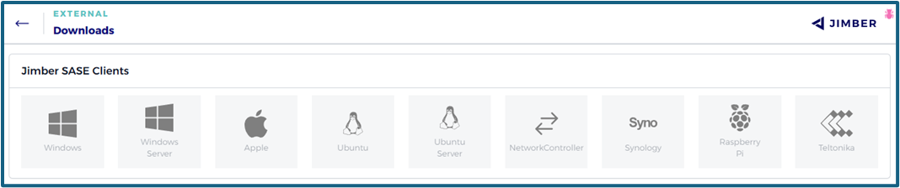

#### Platforms

<!-- tabs:start -->

<!-- #### Windows <i class="mdi mdi-microsoft-windows"></i> -->

#### **Windows**

As mentioned, download the latest 'Windows Client' from [Jimber SASE downloads](https://signal.jimber.io/downloads), or use the direct link to access the most recent version for Windows : [latest Windows version](https://signal.jimber.io/clients/windows-desktop-latest.msi)

> [!INFO]
> To download another specific version, you can use this [link](https://signal.jimber.io/clients).

Open the downloaded file to install the `Jimber SASE Client`.
When a subsequent dialogue box emerges, please select 'Yes' to proceed.

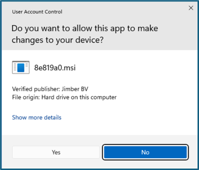

To launch the software, either search for 'Jimber' using the Windows start menu or simply click on the newly created desktop icon.

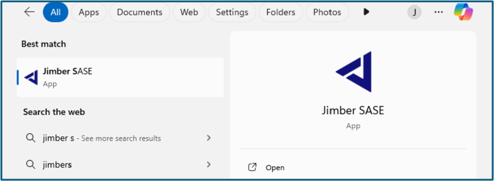

Upon launching the software, the Jimber tray icon will become visible at the bottom right of your screen, indicating that the `Jimber SASE Service` is now running.

> [!INFO]
> The Jimber tray icon can be hidden. Use the up arrow icon  if necessary to view hidden icons.

Click on the Jimber tray icon and select `Sign in`. This will launch a browser page for you to sign in.

> [!INFO]
> Once successfully logged in and connected, a green dot will appear on the Jimber tray icon as confirmation.

If you don't have a login yet, please reach out to your network administrator to set up an account for you.

<!-- #### Mac <i class="mdi mdi-apple"></i> -->

#### **Mac**

> [!WARNING]
> Our Mac client currently only supports installation on a system where the user has sudo/administrator rights.

As mentioned, download the latest 'Mac Client' from [Jimber SASE downloads](https://signal.jimber.io/downloads), or use the direct link to access the most recent version for Mac : [latest Mac version](https://signal.jimber.io/clients/mac-x64-latest.dmg)"

In the Downloads folder, you will find the file `SASE-Mac-1.XX.0.dmg`(XX stands for the version number).

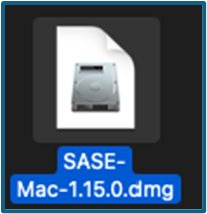

> [!INFO]
> To download another specific version, you can use this [link](https://signal.jimber.io/clients).

Double-click on this file and install the `Jimber SASE Client` by dragging the 'Jimber SASE app' icon into your 'Applications' folder.

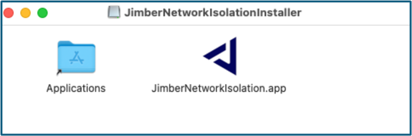 

A pop-up may appear to alert you that you have downloaded a file from the internet, asking if you indeed want to open the file. You can safely answer 'Open' to this prompt.

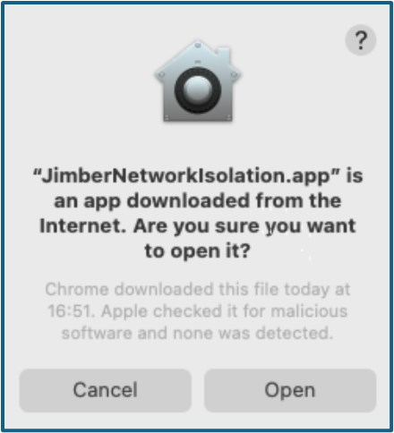

Following the installation, you'll find the JimberNetworkIsolation icon in your Launchpad. Simply search for 'JimberNetworkIsolation' and press `Enter` to launch the application.

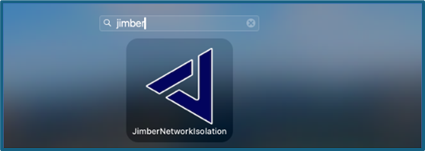

Upon launching the software, the Jimber menu bar icon will become visible at the top right of your screen, indicating that the `Jimber SASE Service` is now running.

Click on the Jimber menu bar icon and select `Sign in`. This will launch a browser page for you to sign in.

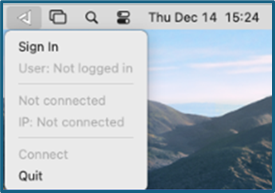.

> [!INFO]
> Once successfully signed in and connected, a green dot will appear on the Jimber menu bar icon as confirmation.

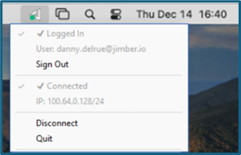

If you're yet to have a login, please reach out to your network administrator to set up an account for you.

<!-- #### Linux <i class="mdi mdi-ubuntu"></i> -->

#### **Linux**

> [!WARNING]
> Support is currently provided for the latest LTS versions of Ubuntu. For other OS distributions, please reach out to our support team.

As mentioned, download the latest 'Linux Client' from [Jimber SASE downloads](https://signal.jimber.io/downloads), or use the direct link to access the most recent version for Linux : [latest Linux version](https://signal.jimber.io/clients/linux-desktop-latest.deb)

> [!INFO]
> To download another specific version, you can use this [link](https://signal.jimber.io/clients).

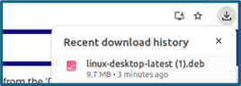

In case you're using a default installer, simply double-clicking the file will install the program.
Without a default installer, you'll encounter the following window by double-clicking.

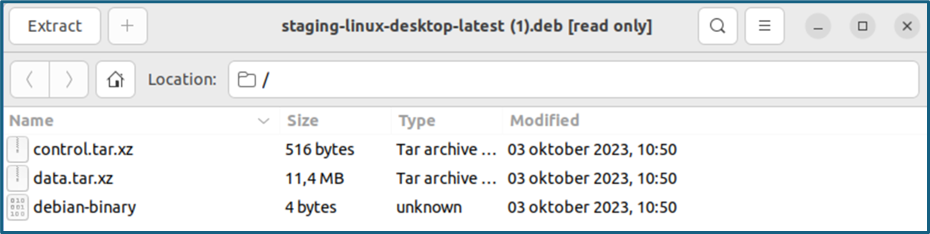

Close the window and browse to `Downloads`. Right-click on the icon and select `Open With Other Application`.

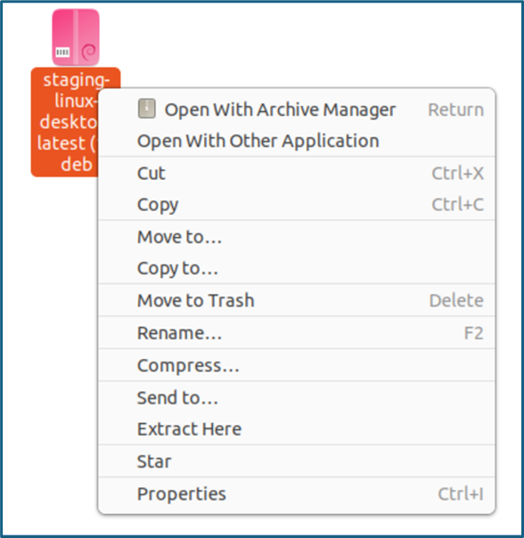

Choose `Software Install`:

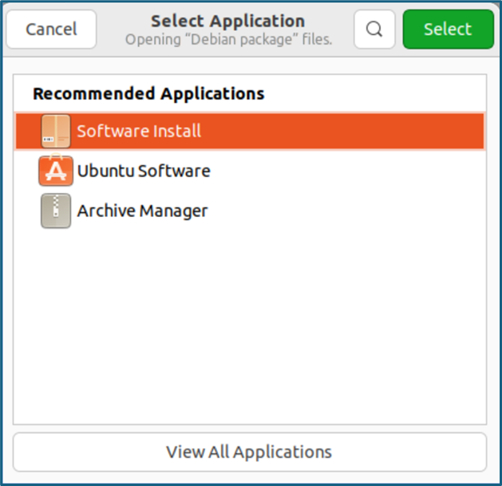

Choose `Install` in the next screen:

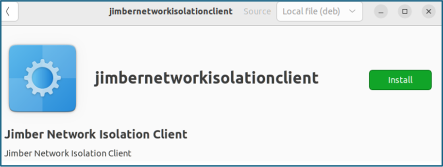

Finally, access the program from your system menu by searching for `Jimber Network Isolation`.

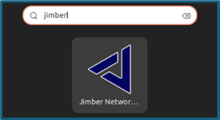

Upon launching the software, the Jimber system tray icon will become visible at the top right of your screen, indicating that the `Jimber SASE Service` is now running.

Click on the Jimber system tray icon and select `Sign in`. This will launch a browser page for you to sign in.

> [!INFO]
> Once successfully logged in and connected, a green dot will appear on the system tray icon as confirmation.

If you're yet to have a login, please reach out to your network administrator to set up an account for you.

<!-- tabs:end -->

---

### The Jimber Tray Icon 

After signing in, clicking on the icon will show you this tray:

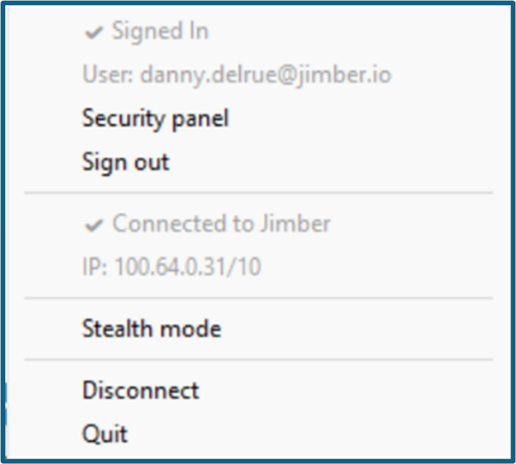

- `Security panel`: here you get an overview off the services and your devices. Comprehensive information on services can be found [here](/./rules/services/services.md).
- Choose `Sign out` to sign out of the application. You get this warning:

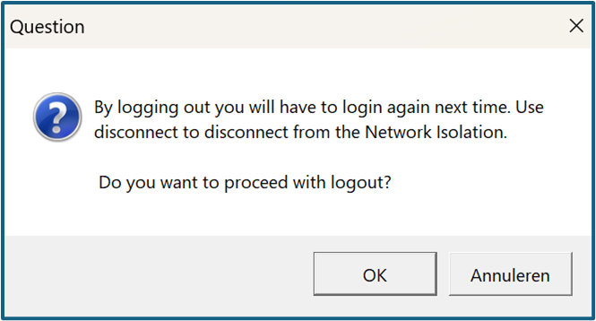

- `Stealth mode` ensures that traffic is sent via HTTPS, allowing you to connect to Jimber even on hotspots, etc.
   To use this feature, port 51820 is normally used.
- `Disconnect` will disconnect you from the *`Jimber SASE Platform`*, but you stay signed in.
- `Quit` closes the application.

### User Device Details

In the overview of the user devices, you can already see some properties:

- Operating System, indicated by a red or green OS icon: , , .
- Name of the device.
- Whether Secure Mode is active, disabled or unsupported.
- IP-address.
- Approval status.

>[!NOTE]
>The "Device Approval" feature on our platform adds an extra layer of security and control by requiring administrative approval before a device can be added to the network. This process ensures that only authorized devices are granted access, helping to maintain the integrity and security of the network.

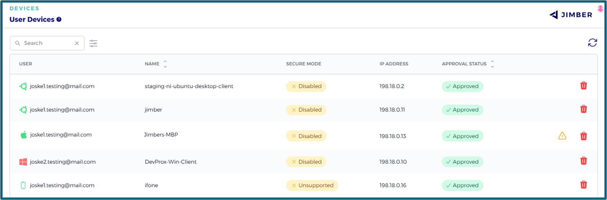

The overview also allows you to see which devices are online or offline:

- A user device online will appear at the top of the list in the overview with a green OS icon at the start of it's row.
- A user device offline will appear in the overview with a red OS icon at the start of it's row.
- A mobile user device online will appear in the overview with a green mobile device icon  at the start of it's row.
- A user device that requires an update will appear in the overview with a yellow warning triangle icon  before the delete icon  at the end of it's row. 

Clicking on the corresponding strip of the user device opens a new window with more details:

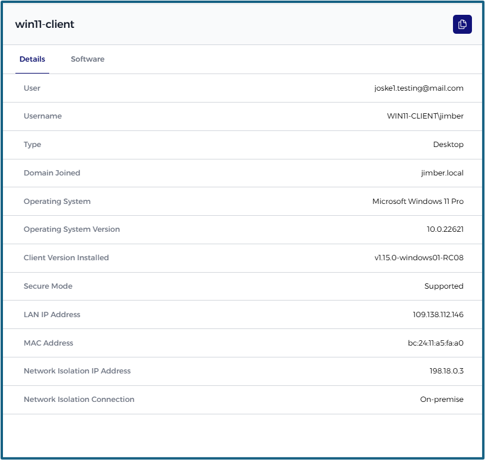

The software tab shows the installed antivirus software:

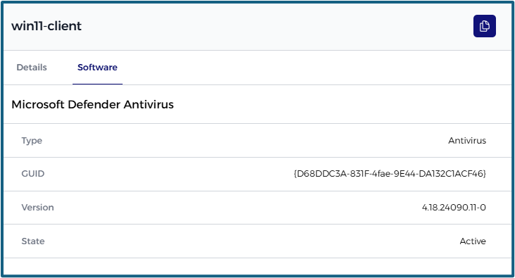

The info can be copied by using the copy button  in the right upper corner.

### Filter User Devices

You can search the list of user devices using the search box at the top of the page. This helps you quickly find and manage the device you're looking for.

- Use the search box to enter keywords and filter the device list.

Next to the search box, there is a filter icon . When clicked, it reveals advanced filtering options where you can define additional conditions based on the following three elements:

- **Property**: A dropdown menu where you choose the field to filter on.
- **Match type**: A dropdown that allows you to select how to match the value (`equals`or `contains`).
- **Value**: Enter or select the value to match, depending on the selected property.

To add multiple filters you can press the filter icon  again and then press the `+` button.

<!-- Once filters are applied:
- The results are updated to reflect your conditions.
- Active filters appear at the top of the page.
- You can remove filters individually by clicking the `X` next to each, or remove all at once by clicking the `Reset Filters` button. -->

> [!INFO]
> You can refresh the list of user devices by pressing the refresh icon  at the top of the page.

### Delete user devices

User devices can be deleted by clicking on the delete icon  in their row.

> [!WARNING]
> When removing an active device it will immediately be disconnected from the *`Jimber SASE Platform`*. The user will have to log in on the device and, if enabled, have the device approved on the *`Jimber SASE Platform`* to add the device again.

You will receive a warning before the device is deleted:

